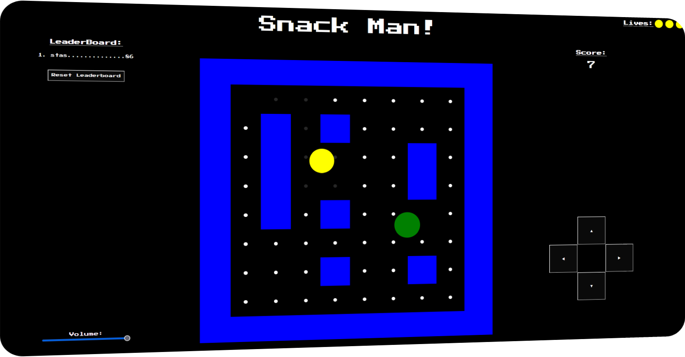

# SnackMan
SnackMan is a PackMan clone made entirely in JavaScript.

  

## Features

- **A variety of features:**
- **Game Music:** Music plays on loop thoroughout the game, can be controlled via a volume slider.
- **Score Board:** Save your score locally on your browser, and clear it if needed.
- **On Screen Controls:** An alternative to using the keyboard keys.
- **Level Progression:** Progress to the next level after picking up all points.
- **Randomized Maze:** No level is the same!
- **Increasing Difficulty:** More enemies appear after progressing to next level.
- and much more!

## Usage

- **GitHub Pages: https://stasyanski.github.io/SnackMan/**

## Important!

- **Game Audio Reference** 
- **Loop Game Audio:** https://pixabay.com/sound-effects/8bit-music-for-game-68698/
- **Point Pickup Audio:** https://pixabay.com/sound-effects/8-bit-video-game-points-version-1-145826/

## License

The MIT License lets you do almost anything you want with this project, even making and distributing closed source versions.

